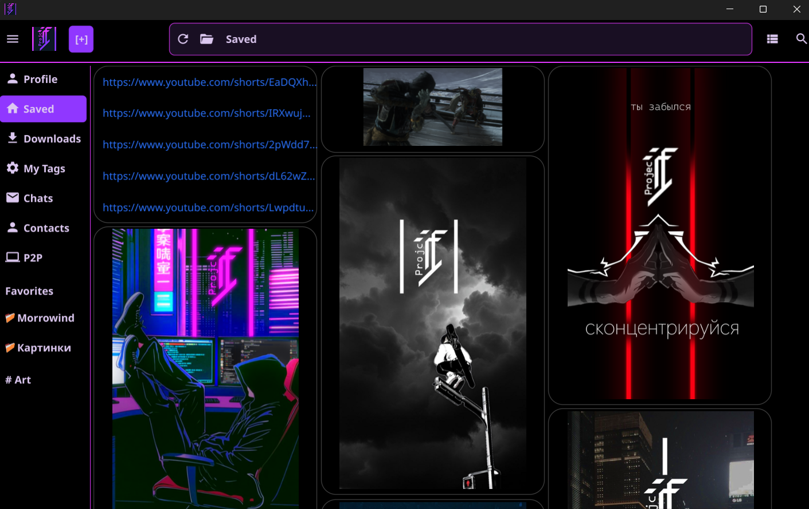

<h1 align="center">Hi traveler, I'm Egor 👋</h1>

  

## 👨‍💻 About Me

I'm a software engineer with ~3 years of experience, driven by a passion for building systems that solve real problems. While my core is **backend development**, I work comfortably across the full stack. I'm a strong believer that the architecture and logic are universal, and syntax is just a detail that tools (and AI) can handle.

*   **Core Expertise:** High-load backend systems, system architecture, algorithmization, and data flow design.
*   **Full-Stack Capable:** I can build a robust backend and a functional frontend. I'm not a pixel-perfect designer, but I can make it work.
*   **AI-Augmented Development:** I actively use AI assistants to accelerate development, research new stacks, and maintain momentum even when tired.
*   **Always Learning:** Currently focused on deepening my knowledge of web protocols, hosting, and networking to close gaps in my expertise.
*   **Telegram Bot Development:** Experienced in building custom Telegram bots for automation, notifications, and internal workflows.

## 🛠️ Tech Stack

### Backend

  
  
  
  
  
  

### Databases & Queues

  
  
  
  

### DevOps & Infrastructure

  
  
  
  
  

### Frontend & Tools

  
  
  
  
  
  

## 💼 Commercial Experience Highlights

*   Refactored monolithic services into microservices architecture.
*   Optimized SQL queries, reducing database load by 40%.
*   Fixed Kafka notification duplication with exactly-once delivery.
*   Integrated Prometheus & Grafana for real-time monitoring.
*   Built Telegram bots for internal automation and notifications.
*   Migrated legacy codebases to modern frameworks.
*   Designed REST APIs with OpenAPI/Swagger documentation.
*   Implemented CI/CD pipelines using GitHub Actions.
*   Set up Docker containers for development and production.
*   Debugged production incidents and reduced downtime.

## 🚀 Featured Projects

### 🗂️ ProjectT – Decentralized Platform for Collections

**A hybrid of a file explorer, Pinterest, and messenger, built with Go and libp2p.**

This is my magnum opus — a long-term project designed to be a privacy-focused alternative to centralized platforms. It's a P2P application where objects (text, images, files, links) live as semantic units, not scattered files.

*   **My Role:** Sole developer, architect, and designer. I built everything from scratch.
*   **Key Challenge:** The most difficult part was mastering NAT traversal, configuring libp2p protocols (DHT, relay, mDNS, pubsub), and ensuring end-to-end encryption worked flawlessly across the network.
*   **Current Status:** Already usable in its current state. My next steps are migrating to an HTML/CSS-based UI framework and continuing optimization.

[🔗 View on GitHub](https://github.com/Drekard/projectT)

### 🌐 Pitomnik- – Landing Page / Demo Website

**A simple landing page built as a demo project to showcase front-end capabilities.**

Created in one evening based on a vague technical requirement ("just make a website"). It demonstrates clean, functional layout with HTML, CSS, and a touch of JavaScript — all without a backend.

[🔗 View on GitHub](https://github.com/Drekard/pitomnik-)

## 📊 What I'm Currently Learning

-   Deepening expertise in web protocols, hosting, and DNS configuration.
-   Leveraging AI tools to automate workflows and streamline development processes.
